# **Freelance Co-working Contract**

#### _A layout of a website for a new co-working startup, 09.14.2018_

##### By Colin Cook

## Description

This project is a website design for a new co-working startup.

## Images

#### _Drawings_

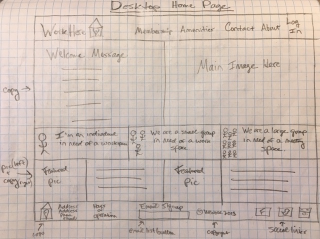


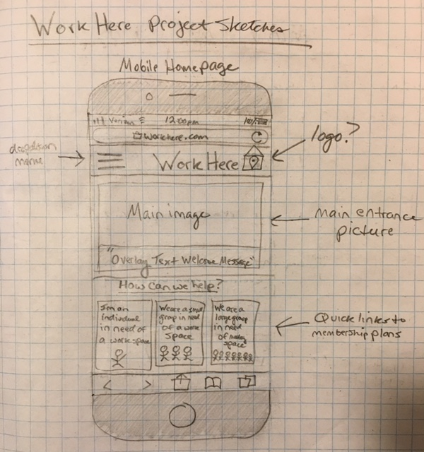

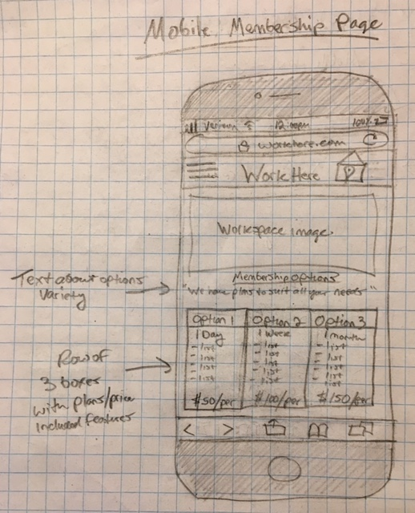

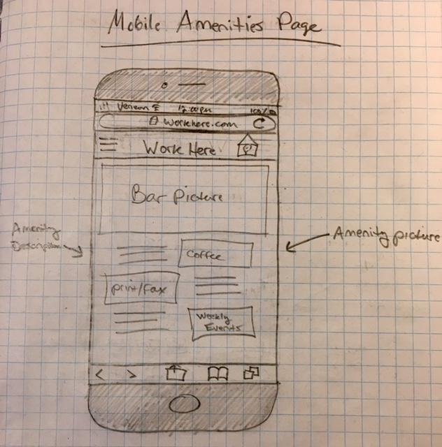

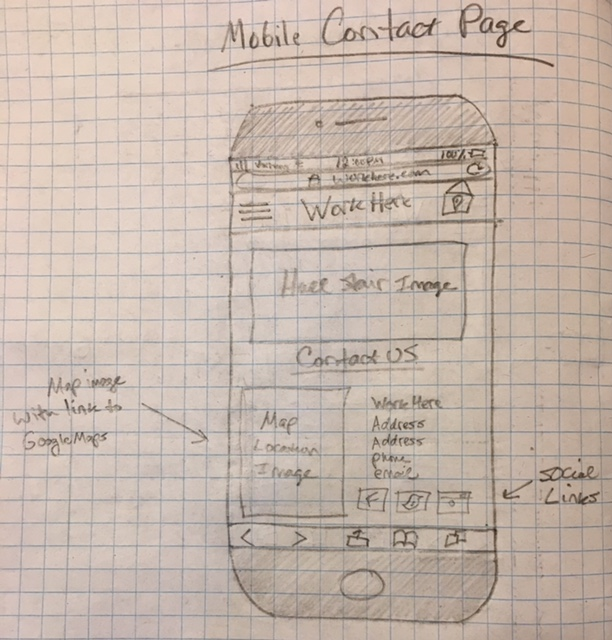


#### _Wireframes_

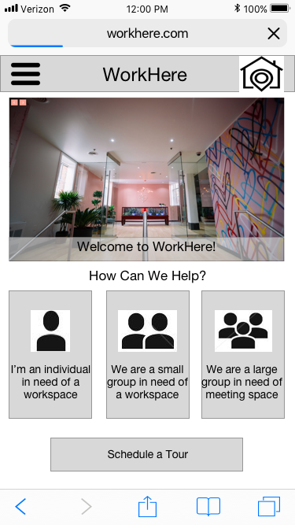

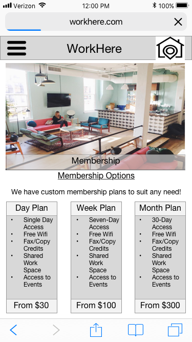

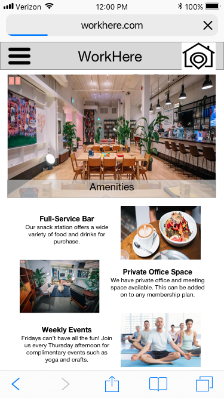

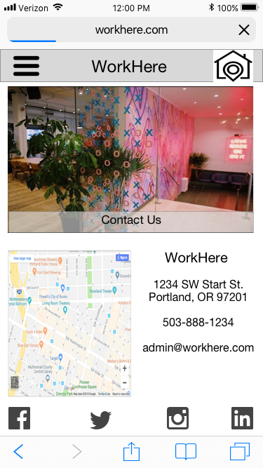

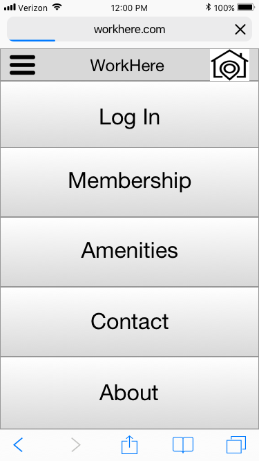

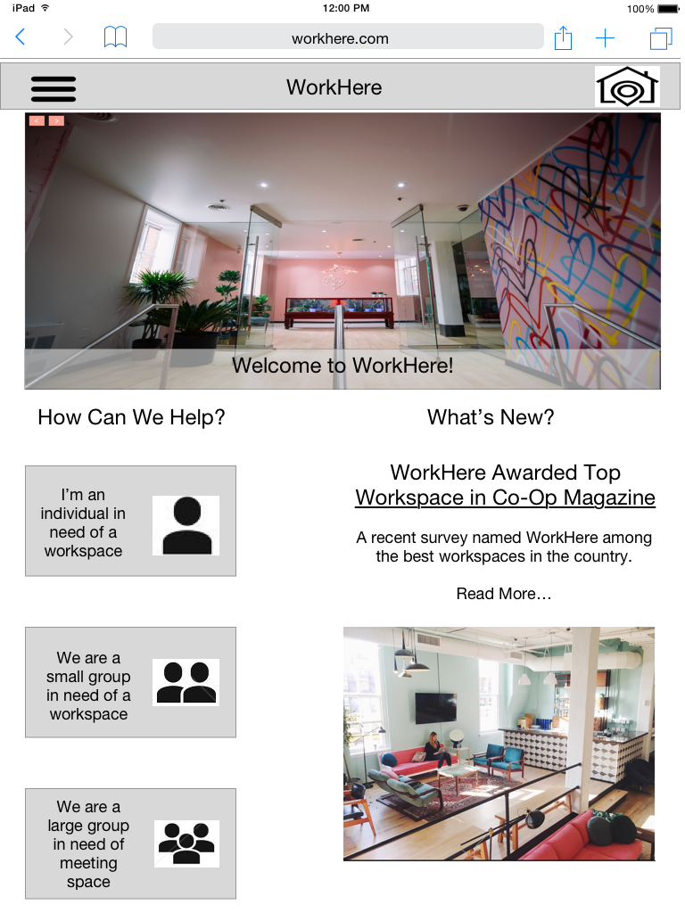

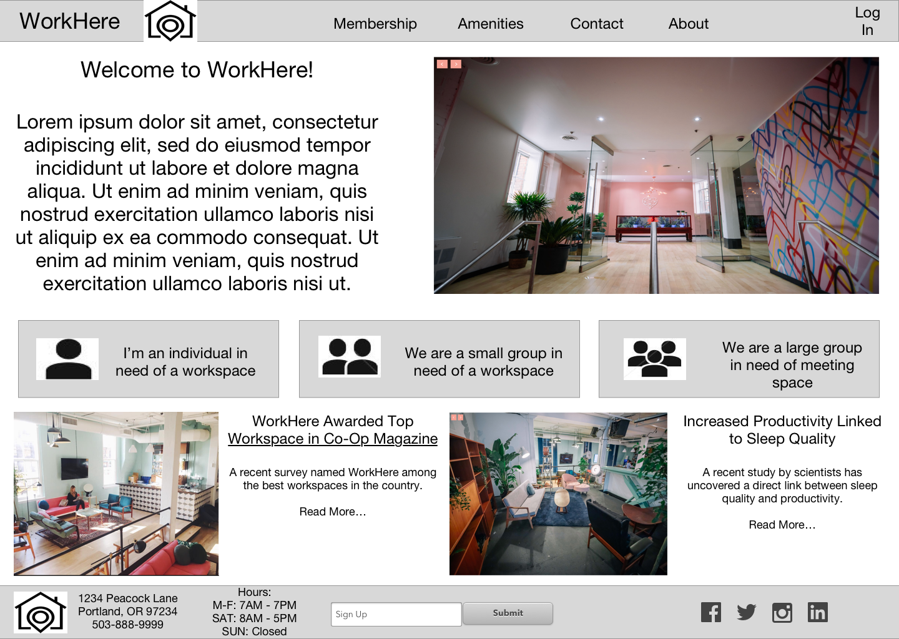

## Specifications

_Target Users:_

* Traveling business person
* Freelance worker / Works from home
* Startup company
* Businesses looking for meeting space
* Business persons wanting a non-traditional office setting

_User Stories:_

Traveling Business Person

* As a traveling business person, I want a quick and easy checkout process so that I can get to work quickly.
* As a traveling business person, I want to see a one-time-use option so that I don't have to sign up for a membership.
* As a traveling business person, I want to see a variety of membership options so that I may plan for future visits.
* As a traveling business person, I want to see a list of locations so that I can plan my travel accommodations accordingly.
* As a traveling business person, I want to see a variety of office space options so that I can choose which suits me best.
* As a traveling business person, I want to see a list of amenities so that this space is better than working from my hotel room.


Freelancer / Works from home

* As a freelancer, I want to see a variety of membership options so that I can choose one to fit my needs.
* As a freelancer, I want membership options to be clearly defined so that I know what I am getting and how much I am paying for it.
* As a freelancer, I want the ability to easily reserve meeting and conference space so that I can plan my meetings without having to worry.
* As a freelancer, I want to see photos of your common spaces so that I can have the option of working in a social environment.
* As a freelancer, I want to see a list of amenities so that I know this space is better than working from home or a coffee shop.


Business person wanting a non-traditional office setting

* As a business person, I want to see a variety of membership options so that I can choose one to fit my needs.
* As a business person, I want to see a list of services and accommodations so that I know I have the resources I need to get the job done.
* As a business person, I want to see photos of your spaces so that I know I am getting something different than my current office space.
* As a business person, I want to see what see sets you apart from your competitors so that I know I am making the right choice.


Startup company

* As a founder of a startup company, I want to see a variety of membership options so that I can choose one to fit my needs.
* As a founder of a startup company, I want membership options to be clearly defined so that I know what I am getting and how much I am paying.
* As a founder of a startup company, I want to know what services and accommodations you offer so that I can be sure the space is right for me.


Company seeking meeting space

* As someone seeking meeting space for my company, I want to see a variety of membership options so that I can choose one to fit my needs.
* As someone seeking meeting space for my company, I want access to support so that I can talk to a live person in coordinating my event.
* As someone seeking meeting space for my company, I want to be able to customize my package so that my experience is tailored to my needs.
* As someone seeking meeting space for my company, I want to see a list of amenities so that I know what I can choose from.
* As someone seeking meeting space for my company, I want to see a list of events so that I can schedule my meetings accordingly.

_Research and Inspiration:_

Look/Feel to convey through website:
  * Luxurious
  * Cool
  * High-end
  * Welcoming
  * Inclusive
  * Safe
  * Comfortable
  * Productive
  * Funky
  * Local
  * Fun

Considerations and Design Influence:
  * Use a variety of images depicting all different facets of the space.
  * Images depicting people at work help convey productivity.
  * Let the images convey the cool/fun/high-end vibe of the site.
  * Use words to convey the welcoming, safe, inclusive feel.
  * Include images and references to local attractions.
  * List proximity to local businesses/landmarks (i.e. "Five minute walk to locally-owned bookstore" or "Two blocks away from family-owned deli")
  * Make plans/pricing/amenities priority. Easy to read and understand.
  * Simple/sleek design for landing page.
  * Navigation bar up top with clearly defined links.

Resources:
  * [WeWork](https://www.wework.com/)
  * [Techspace](https://www.techspace.com/)
  * [Fueled Collective](https://fueledcollectivemn.com/)
  * [Taborspace](https://taborspace.org/)
  * [Desk and Mug](http://www.deskandmug.com/)


## Setup/Installation Requirements

* In Terminal, navigate to project directory.
* ```$ npm run start```


## Responsiveness

This design includes versions for mobile, tablet and desktop device viewing.


## Technologies Used

* NPM
* Sass
* Sketch


## Support and contact details

I would love to hear from you! If you have any issues with this application or have any suggestions on how it could be improved, please let me know.

Email me at [ccook987@gmail.com](mailto:ccook987@gmail.com)


### License

This software is licensed under the MIT license.

Copyright (c) 2018 Colin Cook
